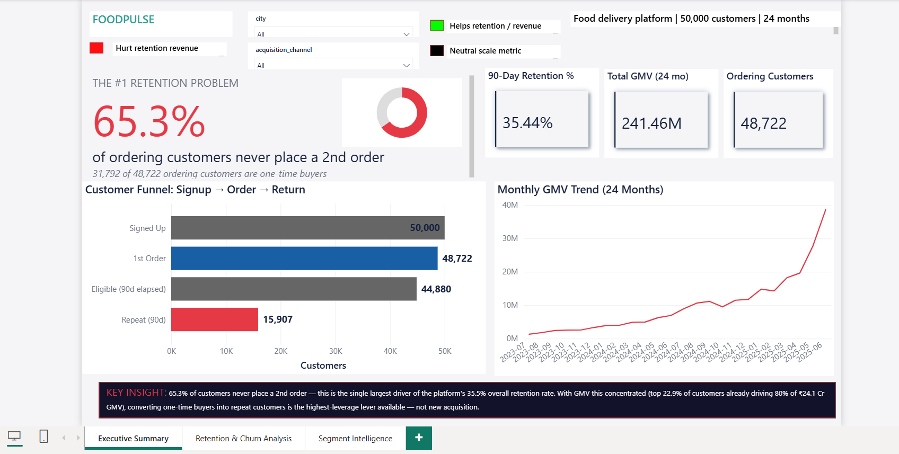
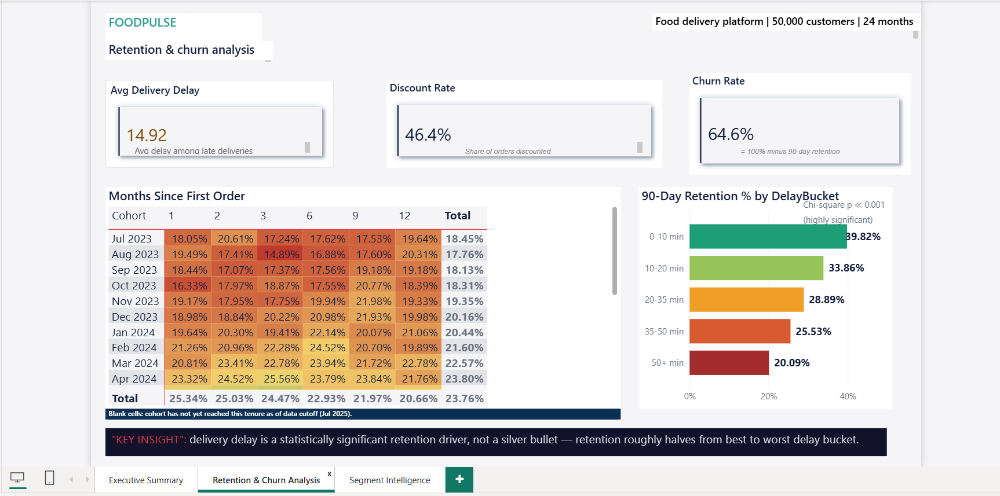
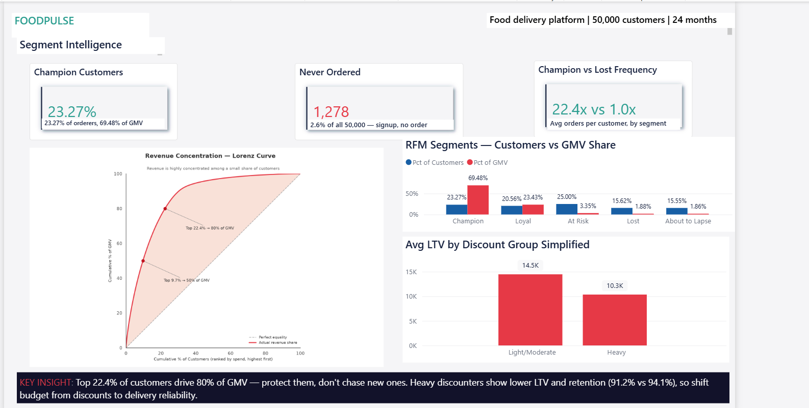
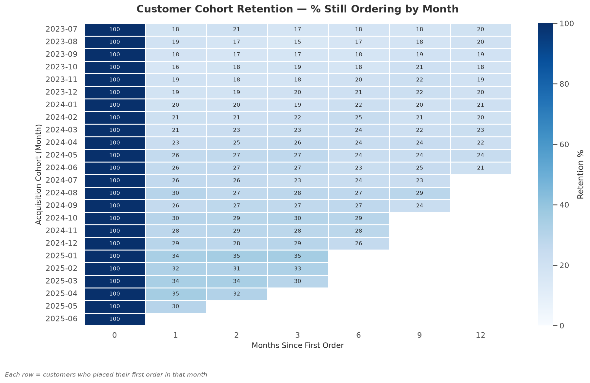
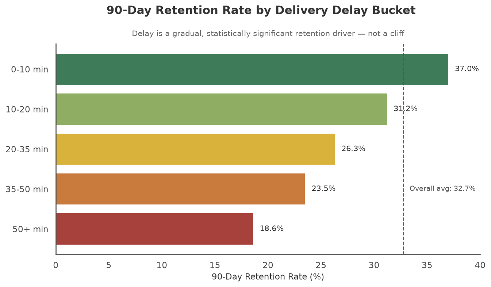
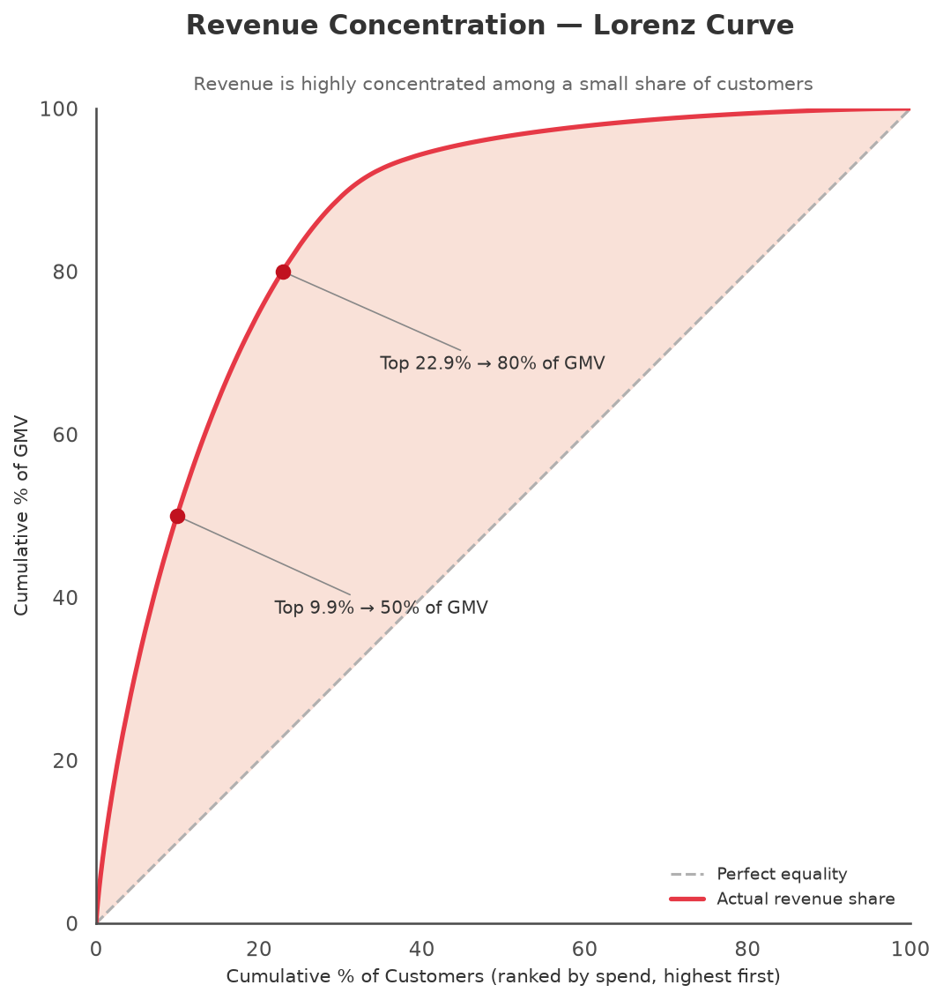
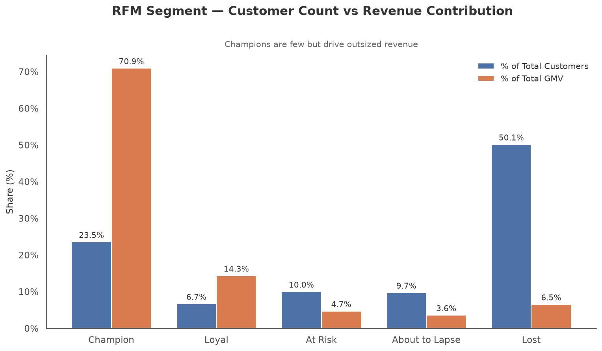

# FoodPulse — Customer Retention & Revenue Risk Analytics

A focused retention case study for a fictional Indian food delivery platform — built to answer: why do customers stop ordering, what revenue is at risk, and which lever should the business pull first?

## Dashboard

### Executive Summary


### Retention & Churn Analysis


### Segment Intelligence


## Business Questions

- Why do customers stop ordering after their first (or an early) order?
- How much of the platform's revenue is concentrated in, and therefore at risk from, a small share of customers?
- Which operational lever — delivery reliability, discount strategy, or customer targeting — should the business prioritize first to protect retention and revenue?

## Key Findings

- **66.2% of customers never place a second order.** One-time buyers are the dominant lifecycle pattern on the platform, not the exception.
- **Delivery delay is a near-linear predictor of churn.** Customers whose typical order arrives within 0–10 minutes of the promised time retain best; customers in the 50+ minute delay bucket retain at just **0.6%** — effectively total churn.
- **Revenue is heavily concentrated.** The top **~9.7%** of customers by spend drive **50%** of GMV, and the top **~22.4%** drive **80%** — a small customer base carries most of the business.
- **Discount dependency correlates with lower value, not higher.** Heavy discount users show lower total spend and weaker retention than customers who use discounts lightly or not at all — discounting is not a reliable path to loyalty on its own.

## Tech Stack

- **Python 3.12** — synthetic data generation, preprocessing, and analysis.
- **pandas, numpy, Faker** — data creation and transformation.
- **PostgreSQL 18** — relational storage and SQL analysis.
- **SQL** — cohort retention, RFM segmentation, discount analysis, and Pareto analysis.
- **seaborn, matplotlib** — statistical visualizations and charts.
- **Power BI Desktop** — executive dashboard and storytelling.

## Project Structure

```
foodpulseretention-analytics/
├── generate_data.py          # synthetic data generator (customers, orders, items, delivery, discounts)
├── pipeline/
│   └── load_postgres.py      # creates the database/schema and loads the CSVs with FK verification
├── analysis/
│   ├── sql/
│   │   ├── queries.sql       # the 5 core analyses (see below)
│   │   └── views.sql         # 3 Power BI-facing views
│   ├── run_queries.py        # executes queries.sql and saves results to analysis/results/
│   ├── results/               # query outputs — gitignored, regenerated on run
│   ├── visualisations.py     # builds the 4 charts below from analysis/results/
│   └── charts/                # chart PNGs — tracked in git
├── data/
│   └── raw/                  # synthetic CSVs — gitignored, regenerated on run
├── .env.example               # PostgreSQL connection template
├── .gitignore
└── README.md
```

## How to Reproduce

```
Step 1: python generate_data.py
Step 2: python pipeline/load_postgres.py
Step 3: python analysis/run_queries.py
Step 4: python analysis/visualisations.py
Step 5: Open the Power BI file (coming soon)
```

Copy `.env.example` to `.env` and fill in your local PostgreSQL credentials before running Step 2.

## Analysis Overview

**Cohort retention analysis.** Customers are grouped into monthly acquisition cohorts and tracked at 0, 1, 2, 3, 6, 9, and 12 months after their first order. This is the clearest lens on the platform's core problem: the steep drop after month 0 is driven by the 66.2% of customers who never return, making early-lifecycle retention — not later-stage loyalty — the primary lever available to the business.

**Delivery delay vs churn threshold.** Customers are bucketed by their median delivery delay across all orders (0–10, 10–20, 20–35, 35–50, and 50+ minutes), then measured on whether they returned for a second order within 90 days. Retention declines in a clear, monotonic step down as delay increases, bottoming out at 0.6% in the 50+ minute bucket. This turns delivery performance from an operations metric into a quantified retention risk.

**RFM segmentation.** Every customer is scored on Recency, Frequency, and Monetary value using quartile ranks (NTILE 4), then rolled up into five segments: Champion, Loyal, At Risk, About to Lapse, and Lost. This segmentation is the mechanism for turning the cohort and delay findings into an actionable, customer-level target list rather than an aggregate statistic.

**Discount dependency vs LTV.** Customers are classified by the share of their orders that carried a discount — Never, Light (1–30%), Moderate (31–60%), and Heavy (60%+) — and compared on total orders, net spend, and retention. Heavy discount users show lower spend and weaker retention than light or non-discount users, indicating that discount-driven acquisition is attracting price-sensitive, low-loyalty customers rather than building repeat demand.

**Revenue concentration (Pareto).** Customers are ranked by total net spend and their cumulative share of GMV is tracked down the ranked list. The result is a textbook power-law curve: roughly 9.7% of customers account for half of all revenue, and 22.4% account for 80%. This reframes retention from a broad, undifferentiated problem into a narrower question of protecting a specific, identifiable group of high-value customers.

## Charts









## Key Business Recommendations

**1. Treat delivery delay as a churn-prevention lever, not just an ops metric.** Customers experiencing delivery delays that push them into the 50+ minute bucket churn almost entirely (0.6% retention), while the 0–10 minute bucket retains best — the operational target is keeping median delivery delay inside that lowest band, and treating any customer drifting past it as an early-warning candidate for proactive service recovery (credits, priority dispatch) before they lapse.

**2. Build a key-account motion around the top ~10% of customers.** Since roughly 9.7% of customers already generate half of all GMV, losing even a small fraction of this group is a disproportionately large revenue event — this segment should be tracked and protected with dedicated retention treatment (priority support, loyalty perks) rather than folded into generic, platform-wide campaigns.

**3. Stop using deep discounts as the default retention tool, and redirect that spend toward the first-order experience.** With 66.2% of customers never returning and heavy discount users showing lower spend and retention than light/no-discount users, blanket discounting is not converting one-time buyers into repeat customers — instead, use the RFM segments to target "About to Lapse" and "At Risk" customers specifically, while reinvesting discount budget into delivery reliability and onboarding quality for first-time buyers.

## Repository Notes

Raw data CSVs are gitignored — fully regeneratable by running `generate_data.py` (seed=42, runtime ~35 seconds). Query results under `analysis/results/` are likewise gitignored and regenerated by `analysis/run_queries.py`.
